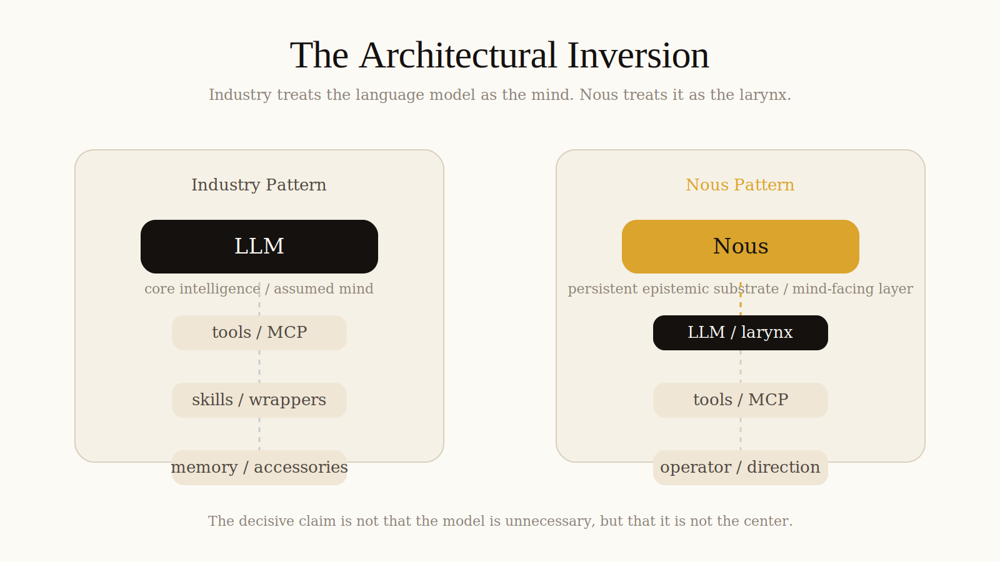

<p align="center">
  
</p>

<p align="center">
  <strong>Language models are a larynx. Nous is a plastic metacognitive layer for AI.</strong>
</p>

<p align="center">
  A persistent epistemic substrate that stores typed relations, graded uncertainty, contradiction boundaries, and memory across time.
</p>

<p align="center">
  <a href="https://discord.gg/Fbwmr7Vv"></a>
  <a href="https://pypi.org/project/nouse/"></a>
  <a href="https://github.com/base76-research-lab/Nous/actions/workflows/tests.yml"></a>
  <a href="https://www.python.org/downloads/"></a>
  <a href="LICENSE"></a>
  <a href="https://github.com/base76-research-lab/Nous/wiki"></a>
</p>

<p align="center">
  <a href="#quick-start">Quick Start</a> · <a href="#the-architectural-inversion">Inversion</a> · <a href="#what-nous-is">What Nous Is</a> · <a href="#the-result">Evidence</a> · <a href="#research">Research</a> · <a href="#roadmap">Roadmap</a> · <a href="#community">Community</a>
</p>

<p align="center">
  
</p>

---

## The Architectural Inversion

Most AI systems still place the language model at the center and attach tools, memory, and wrappers around it.

`Nous` inverts that stack.

<p align="center">
  
</p>

In this picture, the language model is not discarded. It is repositioned.

The model remains the expression system, the semantic surface, the larynx.  
`Nous` is the persistent epistemic layer behind it.

---

## Try Nous In 60 Seconds

```bash
pip install nouse
python - <<'PY'
import nouse

brain = nouse.attach()
result = brain.query("What does this project know about epistemic grounding?")

print(result.context_block())
print("confidence:", round(result.confidence, 2))
PY
```

If Nous already knows something relevant, you get back a grounded context block with validated relations, uncertainty, and explicit boundaries instead of a generic answer blob.

If that output feels more useful than plain chat history or chunk retrieval, then the project is doing its job.

---

## Why It Matters

What is currently called AI is mostly semantic prediction.

`Nous` is an attempt to define a different category of system: one that can preserve knowledge, uncertainty, contradiction, and structural change across time.

- It stores relations, not just retrieved chunks.
- It carries confidence, rationale, and uncertainty with the memory itself.
- It makes the boundary between known, probable, and unknown visible to the model.

That changes agent behavior in the place that actually matters: when a model is close to hallucinating but still sounds fluent.

## The Result

Reference run used for the claim below: `run_20260403_094211` (see `eval/RESULTS_INDEX.md`).

```text
Model                               Score   Questions
─────────────────────────────────────────────────────
llama3.1-8b  (no memory)            46%     60
llama-3.3-70b  (no memory)          47%     60
llama3.1-8b  + Nous memory  →      96%     60
```

**In this reference run, an 8B model with Nous outperformed a 70B baseline.**

The effect is not retrieval. It is *epistemic grounding* — a small, precise knowledge signal
redirects the model's existing priors onto the correct frame, with confidence and evidence attached.
We call this the **Intent Disambiguation Effect**.

→ Full benchmark details: [eval/RESULTS.md](eval/RESULTS.md) · [eval/RESULTS_INDEX.md](eval/RESULTS_INDEX.md) · [Run it yourself](#run-the-benchmark-yourself)

---

## What You Get

| Capability | What it does |
| --- | --- |
| Structured memory | Stores typed relations between concepts instead of plain text chunks |
| Confidence-aware retrieval | Returns what is known, with evidence and uncertainty attached |
| Gap awareness | Surfaces where knowledge ends instead of bluffing through it |
| Continuous learning | Strengthens or weakens graph paths over time via Hebbian plasticity |
| Local-first runtime | Runs as a local graph and daemon, then injects context into any LLM |

---

## What Nous Is

Nous (νοῦς, Gk. *mind* / *active intellect*) is a **plastic metacognitive layer** — a persistent, self-growing epistemic substrate that attaches to any LLM.

It is informed by brain-inspired plasticity, cognitive research, and the practical failure modes of LLM memory.

```text
Your documents, conversations, research
           ↓
    Nous knowledge graph
    (SQLite WAL + NetworkX + Hebbian learning + evidence scoring)
           ↓
    brain.query("your question")
           ↓
    Structured context injected into any LLM prompt:
      — what is known (relations + confidence)
      — why it is known (evidence chain)
      — what is NOT known (gap map from TDA)
```

It is **not** a RAG system. RAG retrieves chunks. Nous extracts *relations* — typed, weighted,
evidence-scored connections between concepts — and injects a compact, structured context block.

It is **not** just a memory system. Memory stores and retrieves. Nous maintains an epistemic
account: every relation carries a trust tier (hypothesis / indication / validated), a rationale,
and a contradiction flag. The system knows the difference between what it has evidence for
and what it is guessing.

It **learns continuously**. Every interaction strengthens or weakens connections (Hebbian plasticity).
There is no retraining. No gradient descent. The graph grows — and the gaps become visible.

---

## How Nous Differs From Alternatives

| System | Main unit | Knows confidence | Knows what's missing | Learns over time | Local-first |
| --- | --- | :---: | :---: | :---: | :---: |
| **Basic RAG** | text chunk | ✗ | ✗ | ✗ | ✓ |
| **Vector memory** | embedding | ~ | ✗ | ✗ | ✓ |
| **Mem0** | memory objects | ~ | ✗ | ~ | ✓ |
| **MemGPT / Letta** | conversation pages | ✗ | ✗ | ~ | ✗ |
| **Claude Memory** | key-value | ✗ | ✗ | ✗ | ✗ |
| **Nous** | typed relation + evidence | **✓** | **✓** | **✓** | **✓** |

Nous is not trying to replace the model. It gives the model a brain-like memory substrate it can query before speaking.

---

## Quick start

```bash
pip install nouse
```

```python
import nouse

# Auto-detects the local daemon if it is running.
# Otherwise falls back to direct local graph access.
brain = nouse.attach()

result = brain.query("transformer attention mechanism")

print(result.context_block())
print(result.confidence)
print(result.strong_axioms())
```

If the daemon is running, `attach()` connects over HTTP. Otherwise it falls back to direct local graph access. The same code works either way.

Works with any provider — OpenAI, Anthropic, Groq, Cerebras, Ollama:

```python
# You handle the LLM call. Nous handles the memory.
context = brain.query(user_question).context_block()
response = openai.chat(messages=[
    {"role": "system", "content": context},
    {"role": "user",   "content": user_question},
])
```

## Use With OpenAI, Anthropic, Ollama Or Groq

### OpenAI

```python
from openai import OpenAI
import nouse

client = OpenAI()
brain = nouse.attach()

question = "How does residual attention affect token relevance?"
context = brain.query(question).context_block()

response = client.chat.completions.create(
       model="gpt-4.1-mini",
       messages=[
              {"role": "system", "content": context},
              {"role": "user", "content": question},
       ],
)

print(response.choices[0].message.content)
```

### Anthropic

```python
from anthropic import Anthropic
import nouse

client = Anthropic()
brain = nouse.attach()

question = "What does this repo know about topological plasticity?"
context = brain.query(question).context_block()

response = client.messages.create(
       model="claude-3-7-sonnet-latest",
       max_tokens=800,
       system=context,
       messages=[
              {"role": "user", "content": question},
       ],
)

print(response.content[0].text)
```

### Ollama

```python
import ollama
import nouse

brain = nouse.attach()

question = "Summarize what is known about epistemic grounding."
context = brain.query(question).context_block()

response = ollama.chat(
       model="qwen3.5:latest",
       messages=[
              {"role": "system", "content": context},
              {"role": "user", "content": question},
       ],
)

print(response["message"]["content"])
```

### Groq

```python
from groq import Groq
import nouse

client = Groq()
brain = nouse.attach()

question = "What does this project know about Hebbian learning?"
context = brain.query(question).context_block()

response = client.chat.completions.create(
    model="llama3-8b-8192",
    messages=[
        {"role": "system", "content": context},
        {"role": "user", "content": question},
    ],
)
print(response.choices[0].message.content)
```

The pattern is always the same: `brain.query(...)` first, provider call second.

---

## Managed Nous (Coming)

Nous is local-first today. A managed cloud version is planned:

```python
brain = nouse.attach(api_key="nouse_sk_...")
```

Hosted memory graphs, shared project memory across agents and teams, and zero local setup.
Interested? [Get in touch](mailto:bjorn@base76research.com).

---

## What A Grounded Answer Looks Like

When you query Nous, the model does not just get a blob of context. It gets an epistemic frame:

```text
[Nous memory]
• transformer attention: mechanism for routing token influence across context
       claim: attention modulates token relevance based on learned relational patterns

Validated relations:
       transformer —[uses]→ attention  [ev=0.92]
       attention —[modulates]→ token relevance  [ev=0.81]

Uncertain / under review:
       attention —[is_equivalent_to]→ memory routing  [ev=0.41] ⚑
```

That is the real product surface: not storage, but a more honest and better-calibrated answer path.

---

## Run the benchmark yourself

```bash
git clone https://github.com/base76-research-lab/Nous
cd Nous
pip install -e .

# Generate questions from your own graph
python eval/generate_questions.py --n 60

# Run benchmark (requires Cerebras or Groq API key, or use Ollama)
python eval/run_eval.py \
  --small cerebras/llama3.1-8b \
  --large groq/llama-3.3-70b-versatile \
  --n 60 --no-judge
```

The current benchmark is domain-specific and intentionally small. Its purpose is to test whether a grounded memory signal can redirect the model onto the right frame, not to claim a universal leaderboard win.

For claim consistency, each public benchmark statement should cite an explicit run id from [eval/RESULTS_INDEX.md](eval/RESULTS_INDEX.md).

### Why standard LLM benchmarks do not apply

Evaluating Nous with standard LLM benchmarks — MMLU, ARC, HumanEval, and similar — would be like measuring the sweetness of chocolate with a Scoville scale. The instrument is not merely inaccurate; it is measuring the wrong physical phenomenon entirely.

Standard benchmarks measure **output quality at a single moment**: does the system produce the statistically expected token sequence given this prompt? That is a meaningful question for a language model. Nous is not a language model.

Nous is a **plastic cognitive substrate**: a system that changes its internal structure through what it learns, maintains persistent beliefs with graded uncertainty, consolidates memory asynchronously, and runs a continuous cognitive loop between interactions. The relevant questions are not about outputs — they are about the system's internal epistemic state, how that state evolves over time, and whether that evolution reflects genuine learning rather than pattern matching.

FNC-Bench (in `eval/fnc_bench/`) is built around different primitives: epistemic honesty, contradiction resistance, and confidence calibration. Even these are partial measures. A complete benchmark for a cognitive architecture must be **longitudinal and structural**, not momentary and behavioral. That benchmark does not yet exist — because the category of system it would measure has not existed before.

---

## How the graph grows

```text
Read a document / have a conversation
           ↓
    nouse daemon (background)
           ↓
    DeepDive: extract concepts + relations
           ↓
    Hebbian update: strengthen confirmed paths
           ↓
    NightRun: consolidate, prune weak edges
           ↓
    Ghost Q (nightly): ask LLM about weak nodes → enrich graph
```

The daemon runs as a systemd service. It watches your files, chat history,
browser bookmarks — anything you configure. You never manually curate the graph.

---

## Good Fits

- Coding agents that need stable project memory across sessions
- Research copilots that must preserve terminology, evidence, and uncertainty
- Domain-specific assistants where bluffing is worse than saying "unknown"
- Local-first AI workflows where you want observability instead of hidden memory state

---

## Architecture

```text
nouse/
├── inject.py          # Public API: attach(), NouseBrain, Axiom, QueryResult
├── field/
│   └── surface.py     # SQLite WAL + NetworkX graph interface
├── daemon/
│   ├── main.py        # Autonomous learning loop
│   ├── nightrun.py    # Nightly consolidation (9 phases)
│   ├── node_deepdive.py  # 5-step concept extraction
│   └── ghost_q.py     # LLM-driven graph enrichment
├── limbic/            # Neuromodulation (relevance, arousal, novelty)
├── memory/            # Episodic + procedural + semantic memory
├── metacognition/     # Self-monitoring and confidence calibration
└── search/
    └── escalator.py   # 3-level knowledge escalation
```

---

## The hypothesis (work in progress)

```text
small model + Nous[domain]  >  large model without Nous
```

We have evidence for this in our benchmark. The next step is to test across
more domains, more models, and with an LLM judge instead of keyword scoring.

Contributions welcome — especially domain-specific question banks.

---

## Research


The theoretical foundation for Nous is described in:

- Wikström, B. (2026). **The Larynx Problem: Why Large Language Models Are Not Artificial Intelligence.** [Zenodo](https://zenodo.org/records/19413234) · [PhilPapers](https://philpapers.org/rec/WIKTLP)
- Quattrociocchi, W. et al. (2025). **Epistemia: Structural Fault Lines in Generative AI.** [arXiv:2512.19466](https://arxiv.org/abs/2512.19466)

Wikström (2026) argumenterar att LLMs modellerar uttryckskanalen för intelligens (språk), inte intelligens i sig — och att epistemisk grundning via strukturerade, plastiska kunskapsgrafer är nödvändig.

Quattrociocchi et al. (2025) introducerar begreppet "epistemia" för att beskriva det strukturella glappet där språklig trovärdighet ersätter faktisk epistemisk utvärdering. Artikeln identifierar sju epistemologiska "fault lines" mellan mänskligt och maskinellt omdöme och ger en teoretisk ram för varför system som Nous behövs.

---

## Install & Run Daemon

```bash
pip install nouse

# Start the learning daemon
nouse daemon start

# Interactive REPL with memory
nouse run

# Check graph stats
nouse status
```

Requires Python 3.11+. Graph stored in `~/.local/share/nouse/`.

---

## Roadmap

| Phase | Status | Description |
| --- | :---: | --- |
| **Core engine** | ✅ | SQLite WAL + NetworkX + Hebbian plasticity + TDA gap detection |
| **Multi-provider** | ✅ | OpenAI, Anthropic, Ollama, Groq, Cerebras |
| **MCP integration** | ✅ | Model Context Protocol server for Claude and compatible clients |
| **Cross-domain benchmarks** | 🔄 | Validating on external datasets beyond internal domain |
| **Docker support** | 📋 | One-command deployment for teams |
| **Managed cloud** | 📋 | `nouse.attach(api_key="nouse_sk_...")` — hosted brain for teams |
| **Multi-tenant API** | 📋 | Shared project memory, team collaboration, SLAs |

---

## Community

- [Discord](https://discord.gg/Fbwmr7Vv) — real-time chat, help, show & tell
- [GitHub Discussions](https://github.com/base76-research-lab/Nous/discussions) — Q&A, ideas, research notes, show & tell
- [Open an issue](https://github.com/base76-research-lab/Nous/issues) — bugs, feature requests, domain benchmark submissions
- [Contributing guide](CONTRIBUTING.md) — how to contribute code, benchmarks, examples, and docs

Contributions welcome — especially domain-specific question banks. See [CONTRIBUTING.md](CONTRIBUTING.md) for how.

---

## License

MIT — see [LICENSE](LICENSE)

---

## Contact

Björn Wikström / [Base76 Research Lab](https://github.com/base76-research-lab)

- 𝕏 / Twitter: [@Q_for_qualia](https://x.com/Q_for_qualia)
- LinkedIn: [bjornshomelab](https://www.linkedin.com/in/bjornshomelab/)
- Email: [bjorn@base76research.com](mailto:bjorn@base76research.com)
- Issues: [GitHub Issues](https://github.com/base76-research-lab/Nous/issues)

For security vulnerabilities, see [SECURITY.md](SECURITY.md).
